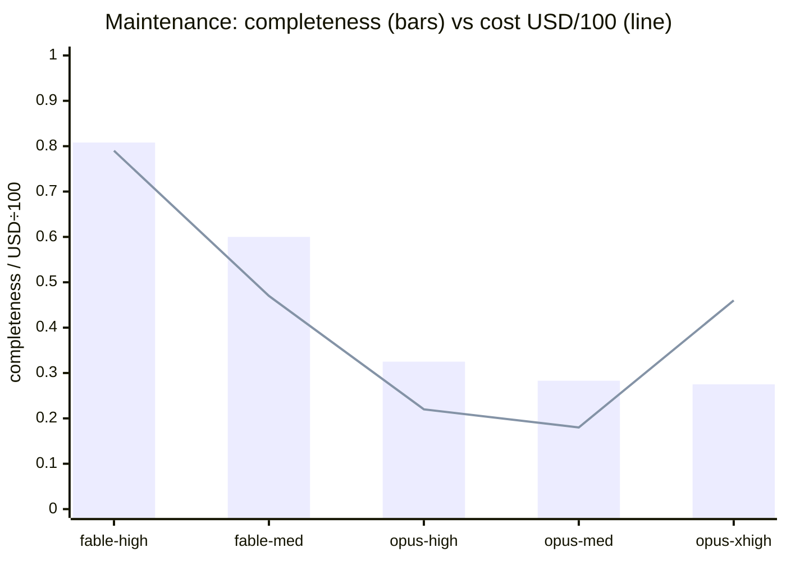

# Autonomous — model × effort benchmarks for unattended agent work

An empirical study of how model family and reasoning effort affect **fully autonomous** software-engineering agents across three work regimes: greenfield construction, detection/audit breadth, and disciplined delivery into a mature codebase. Six benchmarks, one method, 26 judged cells, every verdict backed by mechanical verification and retained evidence.

**Headline result:** no single model×effort cell wins everywhere. Quality leadership flips with the work regime — detection breadth belongs to fable, hard construction to opus-xhigh, cost-efficiency to gpt-5.5 — and the gap between "all checklist items met" and "the feature's purpose achieved" is where expensive depth earns its price.

## 1. Benchmarks

| Benchmark | Regime | Task | Target | Verdict data |
| --- | --- | --- | --- | --- |
| [app-generation/](app-generation/) | Greenfield construction | desktop app for Claude Code session analysis, free (gen1) vs prescriptive (gen2) brief | scratch dirs, real `~/.claude` data | [results](app-generation/results/) |
| [maintenance/](maintenance/) | Detection / audit | full project audit via pinned maintenance skill | [flowai](https://github.com/korchasa/flowai) @ `d28b590f` | [results](maintenance/results/) |
| [ship-easy/](ship-easy/) | Delivery | `runs prune` — destructive CLI behind safety rules ([TASK](ship-easy/TASK.md)) | [flowai-workflow](https://github.com/korchasa/flowai-workflow) @ `c7305ca` | [results](ship-easy/results/) |
| [ship-medium/](ship-medium/) | Delivery | `runs doctor` — journal diagnostics + atomic repair ([TASK](ship-medium/TASK.md)) | same | [results](ship-medium/results/) |
| [ship-hard/](ship-hard/) | Delivery | journal snapshots + crash-safe compaction, 15 MUSTs ([TASK](ship-hard/TASK.md)) | same | [results](ship-hard/results/) |

The three `ship-*` benchmarks form a difficulty ladder calibrated on every axis (code surface, algorithmics, edge-case load, convention archaeology, SRS/docs load, test surface) and share launcher, judge, and pins ([shared/ship/](shared/ship/)).

## 2. Method

### 2.1 Matrix

8 cells per benchmark (5 for the two pre-gpt benchmarks):

- `opus-4.8 × {medium, high, xhigh}` and `fable-5 × {medium, high}` — detached headless `claude -p`, `--permission-mode bypassPermissions`, `--safe-mode` (no plugins/skills/hooks/CLAUDE.md — full isolation from the developer's environment).
- `gpt-5.5 × {medium, high, xhigh}` — detached `codex exec`, `--dangerously-bypass-approvals-and-sandbox`, `--ignore-user-config` (the codex equivalent of the same isolation).

### 2.2 Pinning — the only variables are model and effort

Every input is content-pinned: the target repo **commit**, the **workflow text** (a snapshot of the `ship` composite skill or the maintenance skill, passed as inbound instructions — never as an installed skill that could drift), the **task spec**, and the **agent prompt**. The pinned ship workflow ([ship-SKILL.md](shared/ship/ship-SKILL.md), 575 lines, flowai@`188b5033`) drives a full delivery cycle: plan with variants → TDD implement → self-review with verdict → conventional commit → push, with gates between phases.

### 2.3 Isolation of side effects

Each cell works in its own clone with its own **bare git remote** seeded from the source repo — the Push phase is real (`git push origin bench`, verified byte-for-byte by the judge) but can never touch the actual repository. Benchmark dirs stay read-only during runs; all output goes to a scratch out-root.

### 2.4 Result cache — no re-spend on unchanged pins

Cell outcomes are cached in each benchmark's `cache/` dir, keyed by SHA-256 over all pinned inputs + cell name ([cache-lib.sh](shared/cache-lib.sh)). A re-run with unchanged pins reconstructs the cell (clone + `git am` patches + push) with zero LLM spend. Launcher mechanics are deliberately excluded from the key (harness fixes must not invalidate results); failed cells (rate limits, crashes) are never cached. Judges cache too, keyed over the judged content (branch tips).

### 2.5 Judging — mechanical first

A fixed strong judge cell (`opus:high`, for cross-run comparability) follows a strict order:

1. **Mechanical checks it runs itself**: push reality against the bare remote, the project gate (`deno task check`: fmt, lint, types, full test suite, doc-lint), functional spot-checks — the judge builds throwaway fixtures (fabricated run dirs, broken journals, live locks) and executes each cell's actual CLI against the task's hard requirements, including error paths and byte-exact output formats.
2. **Then** qualitative scoring: per-bullet requirements coverage with `file:line` evidence, workflow fidelity 0–5 (plan variants, TDD traces, recorded review verdict, FR registration), and a defect list.

The maintenance benchmark has no ground truth, so it uses **pooled-union scoring**: findings from all reports are normalized, deduplicated, and each pooled finding is verified against the checkout; completeness = valid/(pooled valid), precision = valid/(valid+invalid).

### 2.6 Cost accounting

From session transcripts at official API rates: opus 5/25, fable 10/50, gpt-5.5 5/30 per Mtok, plus cache-write/read rates (claude: `~/.claude/projects/` `message.usage`; codex: `~/.codex/sessions/` `total_token_usage`). All runs used subscription auth, so dollar figures are normalized estimates, not bills.

## 3. Results

### 3.1 Ship ladder — quality by difficulty

Requirements-met fraction per cell (judge-scored against the task's hard requirements; series: easy, medium, hard):

```mermaid
xychart-beta
  title "Ship ladder: requirements met (1.0 = all; series: easy, medium, hard)"
  x-axis ["opus-med", "opus-high", "opus-xhigh", "fable-med", "fable-high", "gpt5.5-med", "gpt5.5-high", "gpt5.5-xhigh"]
  y-axis "requirements met" 0.5 --> 1
  bar [1.00, 1.00, 0.85, 1.00, 1.00, 0.96, 0.96, 0.96]
  bar [1.00, 1.00, 1.00, 0.88, 1.00, 0.88, 0.97, 1.00]
  bar [0.97, 0.97, 1.00, 1.00, 1.00, 1.00, 1.00, 1.00]
```



The scores compress at the top — **ranks and defects separate the field, not fractions**:

| Cell | easy: rank (defect) | medium: rank (defect) | hard: rank (defect) |
| --- | --- | --- | --- |
| opus-medium | **1** (none) | 4 (none) | 5 (1 low) |
| opus-high | 5 (scope creep) | 6 (1 cosmetic) | 6 (2 low) |
| opus-xhigh | 8 (**over-deletion bug**) | **1** (none) | **1** (none) |
| fable-medium | 7 (scope creep) | 3 (none) | 2 (none, 215 tests) |
| fable-high | 6 (scope creep) | 2 (none) | 3 (none) |
| gpt-5.5-medium | 3 (helper dup) | 8 (**dead-code check**) | 4 (3 low) |
| gpt-5.5-high | 4 (helper dup) | 7 (1 minor) | 8 (**2 major**) |
| gpt-5.5-xhigh | 2 (helper dup) | 5 (1 cosmetic) | 7 (**1 major**) |

All 24 ship cells cleared the hard bars: green gate (`deno task check`), real push verified in the bare remote, one conventional commit, FR registered per SRS conventions.

### 3.2 Ship ladder — cost

```mermaid
xychart-beta
  title "Ship ladder: cost per cell, USD (series: easy, medium, hard)"
  x-axis ["opus-med", "opus-high", "opus-xhigh", "fable-med", "fable-high", "gpt5.5-med", "gpt5.5-high", "gpt5.5-xhigh"]
  y-axis "USD" 0 --> 100
  bar [28.85, 32.38, 41.30, 28.41, 65.19, 6.90, 7.63, 7.64]
  bar [18.32, 30.03, 42.06, 33.74, 60.87, 6.80, 6.93, 7.78]
  bar [36.79, 40.47, 69.98, 81.43, 99.99, 10.14, 8.58, 11.48]
```



gpt-5.5 holds $7–11 at every difficulty (≈96% cache-read input, 10–30× smaller output volume) and finishes in 13–20 min vs 25–65 min for claude cells. Cost scales with difficulty only for claude.

### 3.3 The ladder's central finding: where depth starts paying

- **easy** — depth is wasted: the most expensive cell (opus-xhigh) shipped the run's only real bug (keep-window applied before the safety filter → over-deletion of a recent terminal run); the cheap conservative cells won.
- **medium** — depth starts to matter: rank turned on a subtly-tautological spec item (the replayer *derives* the total the spec asks to cross-check) that demanded inventing a genuine independent check. opus-xhigh first; the only real defect came from gpt-5.5-medium (a dead-code check).
- **hard** — depth is decisive: the premise ("journal grows without bound") had to be *understood*, not just item-matched. Two gpt cells embedded the full event history inside each snapshot, so "compaction" **grows** the file (judge-verified live: 1500→2027 bytes) while nominally meeting all 15 items; gpt-5.5-high also auto-triggered a full replay per node completion (O(n²) — the exact cost the feature must bound). opus-xhigh was flawless: exact 5-step crash-safe protocol, fault hooks at every boundary, dual-review documentation.

### 3.4 Maintenance — detection breadth (5 cells, pre-gpt)

Pooled union: 124 findings across 5 reports, 120 verified valid. Completeness (bars) against cost (line, USD÷100):



| Cell | Valid | Invalid | Completeness | Precision | Cost | Time |
| --- | ---: | ---: | ---: | ---: | ---: | ---: |
| fable-high | **97** | 0 | **0.808** | 1.000 | $79.01 | 41m |
| fable-medium | 72 | 0 | 0.600 | 1.000 | $47.06 | 23m |
| opus-high | 39 | **4** | 0.325 | 0.907 | $22.31 | 21m |
| opus-medium | 34 | 0 | 0.283 | 1.000 | $17.53 | 17m |
| opus-xhigh | 33 | 0 | 0.275 | 1.000 | $45.57 | 36m |

Full inversion versus construction: fable-high found 2.5× more verified issues than the best opus cell with zero false positives (at 3.5× its cost). xhigh effort bought *nothing* in breadth-of-scan — the most expensive opus cell was the least complete.

### 3.5 App-generation — greenfield construction (5 cells, qualitative)

Two generations of a desktop session-analyzer app from the same requirements: gen1 with a free-form brief, gen2 with a prescriptive brief distilled from gen1's best patterns. opus-xhigh built the deepest app (list virtualization, self-measured feature accuracy, most tests); the gen2 prescriptive brief delivered strictly more than gen1 at the same total cost; without a hard DoD requirement, "desktop app" degraded to a browser tab in 4/5 gen1 cells. Detail: [app-generation/README.md](app-generation/README.md).

## 4. Cross-benchmark findings

1. **Regime beats model tier.** Detection breadth: fable dominates. Hard construction: opus-xhigh dominates. Cost-bounded delivery: gpt-5.5 dominates. Buying "the best model" without naming the regime is underspecified.
2. **Effort pays only above a complexity threshold, and only in construction.** xhigh was last on ship-easy (with the run's only bug), first on medium and hard, and bottom-tier on maintenance breadth at 2.6× the price of the winner.
3. **Checklist coverage ≠ purpose achievement.** Ship-hard's two "15/15" gpt cells defeated the feature's purpose (compaction that grows the file). Judges must verify the *premise* mechanically (does the file actually shrink?), not just the items.
4. **Failure modes are model-family-stable.** Three claude cells independently produced the same out-of-scope doc refactor on ship-easy; gpt cells never scope-creeped but twice shipped design-comprehension defects. Discipline and depth fail differently.
5. **Spec ambiguity measures the judge, not the cells.** A factual error in the original easy task (naming a state file the engine never writes) produced two opposite rankings from the same judge, depending on which side it took as ground truth. After the spec was fixed so exactly one variant is correct, ranking became stable. Verify every factual claim in a task spec against the pinned codebase before benchmarking.
6. **Input quality dominates everything.** The gen2 prescriptive brief was worth more than any model upgrade; hard DoD requirements were the only reliable steering.

## 5. Components

| Component | Purpose |
| --- | --- |
| [shared/cache-lib.sh](shared/cache-lib.sh) | content-addressed result cache (SHA-256 over pinned inputs) |
| [shared/ship/run-impl.sh](shared/ship/run-impl.sh) | ship launcher: per-cell clones + bare remotes, claude/codex dispatch, cache, failure isolation |
| [shared/ship/judge-impl.sh](shared/ship/judge-impl.sh) | ship judge: mechanical-first protocol, judge cache |
| [shared/ship/ship-SKILL.md](shared/ship/ship-SKILL.md) | pinned ship workflow snapshot (flowai@`188b5033`) |
| [maintenance/skill/](maintenance/skill/) | pinned maintenance skill snapshot (flowai@`d28b590f`) |
| `<benchmark>/run.sh`, `judge.sh` | thin wrappers; `./run.sh <out-root> [model:effort …]` |
| `<benchmark>/TASK.md` | pinned task spec (part of the cache key) |
| `<benchmark>/cache/` | committed evidence-grade cell outcomes (patches + session logs + meta) |
| `<benchmark>/results/` | retained judge verdicts as dated `{json,md}` pairs |

## 6. Reproducing

```bash
cd agents-comparison/ship-hard
./run.sh ~/tmp/ship-hard-$(date +%Y%m%d)             # full 8-cell matrix (cache hits are free)
./run.sh ~/tmp/one gpt-5.5:xhigh                      # single cell
./judge.sh ~/tmp/ship-hard-$(date +%Y%m%d)            # after all cells exit
```

Requires locally authenticated `claude` and `codex` CLIs. Live progress: transcripts under `~/.claude/projects/` (claude) / `~/.codex/sessions/` (codex) — headless stdout buffers until exit. Changing any pin (TASK.md, workflow snapshot, target commit) changes the cache key and forces fresh runs; deleting a cache entry re-runs one cell.

## 7. Limitations

- **One trial per cell.** Run-to-run variance is unmeasured; ranks within one defect of each other should be read as ties.
- **Single LLM judge** (opus:high). Mechanical checks anchor the big calls, but qualitative ranks inherit one judge's taste; the spec-ambiguity episode (finding 5) shows how fragile judge calibration is without a mechanical anchor.
- **Dollar figures are normalized API-rate estimates** over subscription-billed runs; relative comparisons are sound, absolute values are not invoices.
- **gpt-5.5 joined at the ship family**; maintenance and app-generation predate it (5 cells).
- Tasks target one codebase family (Deno/TypeScript, strict SRS/SDS conventions); generalization to other stacks is untested.
