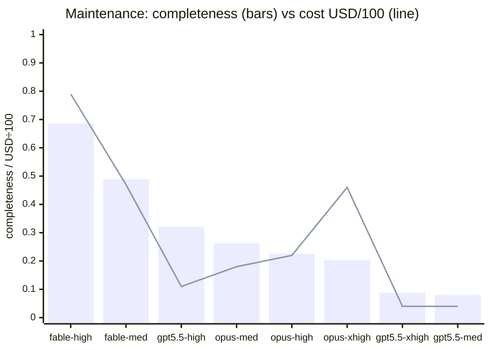
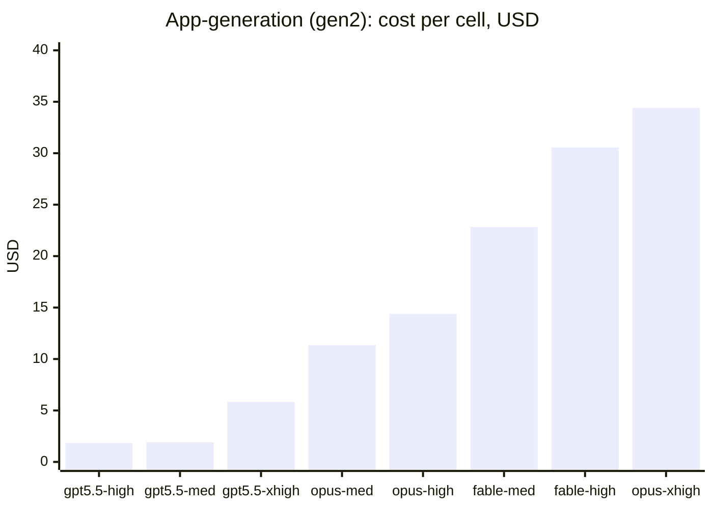
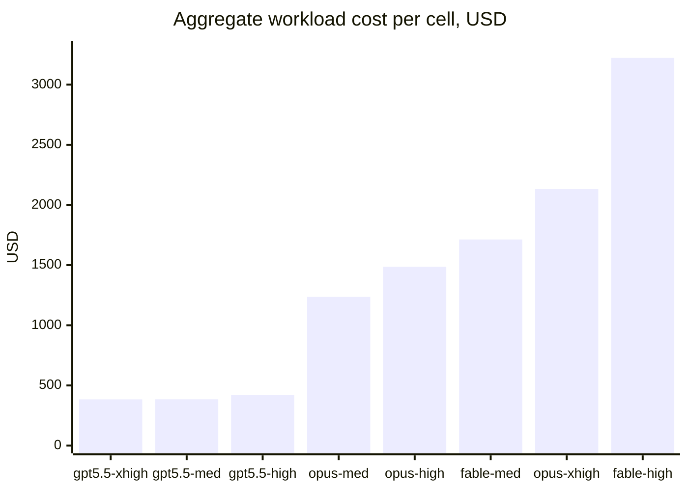

# Agents comparison — model × effort benchmarks for unattended agent work

An empirical study of how model family and reasoning effort affect **fully autonomous** software-engineering agents across three work regimes: greenfield construction, detection/audit breadth, and disciplined delivery into a mature codebase. Six benchmarks, one method, a full 8-cell matrix on every benchmark, every verdict backed by mechanical verification and retained evidence — plus an aggregate workload cost model (§3.6).

> **Disclaimer — read before citing any number.**
>
> - **One run per cell.** Every benchmark×cell pair was executed exactly once; run-to-run variance is unmeasured. Ranks within one defect of each other should be read as ties. A single run supports *descriptive* statements only — every interpretive pattern in this document (§3.3, §4) is a hypothesis for repeated runs, not a conclusion.
> - **flowai instructions in the loop.** All agents worked under the [flowai](https://github.com/korchasa/flowai) framework's skills and project instructions (pinned `/ship` workflow, maintenance skill, `/goal`). Results measure model×effort *inside this harness*, not bare-model capability.
> - **Very small task set.** Five tasks total (three delivery, one audit, one greenfield), all in one codebase family (Deno/TypeScript, strict SRS/SDS conventions). Generalization to other tasks and stacks is untested.
> - **Single LLM judge** (opus:high). Mechanical checks anchor the big calls, but qualitative ranks inherit one judge's taste; the spec-ambiguity episode (§4, finding 5) shows how fragile judge calibration is without a mechanical anchor. All ship defect verdicts were subsequently re-audited against the patches and corrected — see the erratum in §3.1.
> - **Dollar figures are normalized API-rate estimates** over subscription-billed runs; relative comparisons are sound, absolute values are not invoices.

**Snapshot of this run** (one run per cell — descriptive, not conclusive): no single model×effort cell won every benchmark. The leaders differed by work regime — fable on detection breadth, opus-xhigh on hard construction, gpt-5.5 on cost — and several cells that met every checklist item still missed the feature's purpose (§3.3).

## 1. Benchmarks

| Benchmark | Regime | Task | Target | Verdict data |
| --- | --- | --- | --- | --- |
| [app-generation/](app-generation/) | Greenfield construction | desktop app for Claude Code session analysis, free (gen1) vs prescriptive (gen2) brief | scratch dirs, real `~/.claude` data | [results](app-generation/results/) |
| [maintenance/](maintenance/) | Detection / audit | full project audit via pinned maintenance skill | [flowai](https://github.com/korchasa/flowai) @ `d28b590f` | [results](maintenance/results/) |
| [ship-easy/](ship-easy/) | Delivery | `runs prune` — destructive CLI behind safety rules ([TASK](ship-easy/TASK.md)) | [flowai-workflow](https://github.com/korchasa/flowai-workflow) @ `c7305ca` | [results](ship-easy/results/) |
| [ship-medium/](ship-medium/) | Delivery | `runs doctor` — journal diagnostics + atomic repair ([TASK](ship-medium/TASK.md)) | same | [results](ship-medium/results/) |
| [ship-hard/](ship-hard/) | Delivery | journal snapshots + crash-safe compaction, 15 MUSTs ([TASK](ship-hard/TASK.md)) | same | [results](ship-hard/results/) |

The three `ship-*` benchmarks form a difficulty ladder calibrated on every axis (code surface, algorithmics, edge-case load, convention archaeology, SRS/docs load, test surface) and share launcher, judge, and pins ([shared/ship/](shared/ship/)).

## 2. Method

### 2.1 Matrix

8 cells per benchmark:

- `opus-4.8 × {medium, high, xhigh}` and `fable-5 × {medium, high}` — detached headless `claude -p`, `--permission-mode bypassPermissions`, `--safe-mode` (no plugins/skills/hooks/CLAUDE.md — full isolation from the developer's environment).
- `gpt-5.5 × {medium, high, xhigh}` — detached `codex exec`, `--dangerously-bypass-approvals-and-sandbox`, `--ignore-user-config` (the codex equivalent of the same isolation).

### 2.2 Pinning — the only variables are model and effort

Every input is content-pinned: the target repo **commit**, the **workflow text** (a snapshot of the `ship` composite skill or the maintenance skill, passed as inbound instructions — never as an installed skill that could drift), the **task spec**, and the **agent prompt**. The pinned ship workflow ([ship-SKILL.md](shared/ship/ship-SKILL.md), 575 lines, flowai@`188b5033`) drives a full delivery cycle: plan with variants → TDD implement → self-review with verdict → conventional commit → push, with gates between phases.

### 2.3 Isolation of side effects

Each cell works in its own clone with its own **bare git remote** seeded from the source repo — the Push phase is real (`git push origin bench`, verified byte-for-byte by the judge) but can never touch the actual repository. Benchmark dirs stay read-only during runs; all output goes to a scratch out-root.

### 2.4 Result cache — no re-spend on unchanged pins

Cell outcomes are cached in each benchmark's `cache/` dir, keyed by SHA-256 over all pinned inputs + cell name ([cache-lib.sh](shared/cache-lib.sh)). A re-run with unchanged pins reconstructs the cell (clone + `git am` patches + push) with zero LLM spend. Launcher mechanics are deliberately excluded from the key (harness fixes must not invalidate results); failed cells (rate limits, crashes) are never cached. Judges cache too, keyed over the judged content (branch tips).

### 2.5 Judging — mechanical first

A fixed strong judge cell (`opus:high`, for cross-run comparability) follows a strict order:

1. **Mechanical checks it runs itself**: push reality against the bare remote, the project gate (`deno task check`: fmt, lint, types, full test suite, doc-lint), functional spot-checks — the judge builds throwaway fixtures (fabricated run dirs, broken journals, live locks) and executes each cell's actual CLI against the task's hard requirements, including error paths and byte-exact output formats.
2. **Then** qualitative scoring: per-bullet requirements coverage with `file:line` evidence, workflow fidelity 0–5 (plan variants, TDD traces, recorded review verdict, FR registration), and a defect list.

The maintenance benchmark has no ground truth, so it uses **pooled-union scoring**: findings from all reports are normalized, deduplicated, and each pooled finding is verified against the checkout; completeness = valid/(pooled valid), precision = valid/(valid+invalid).

After the first publication of these results, every ship defect verdict was independently **re-audited**: auditor agents re-derived each claim from the cells' patches and reproduced the behavioral bugs live on the pinned base commit. The audit confirmed the factual core but overturned several rank discriminators; the corrected scores carry an erratum note in §3.1.

### 2.6 Cost accounting

From session transcripts at official API rates: opus 5/25, fable 10/50, gpt-5.5 5/30 per Mtok, plus cache-write/read rates (claude: `~/.claude/projects/` `message.usage`; codex: `~/.codex/sessions/` `total_token_usage`). All runs used subscription auth, so dollar figures are normalized estimates, not bills.

## 3. Results

### 3.1 Ship ladder — quality by difficulty

Requirements-met fraction per cell (judge-scored against the task's hard requirements; series: easy, medium, hard):

```mermaid
xychart-beta
  title "Ship ladder: requirements met (1.0 = all; series: easy, medium, hard)"
  x-axis ["opus-med", "opus-high", "opus-xhigh", "fable-med", "fable-high", "gpt5.5-med", "gpt5.5-high", "gpt5.5-xhigh"]
  y-axis "requirements met" 0.5 --> 1
  bar [1.00, 1.00, 0.85, 1.00, 1.00, 0.96, 0.96, 0.96]
  bar [1.00, 1.00, 1.00, 0.88, 1.00, 0.88, 0.97, 1.00]
  bar [0.97, 0.97, 1.00, 1.00, 1.00, 1.00, 1.00, 1.00]
```



The scores compress at the top — **ranks and defects separate the field, not fractions**:

> **Erratum (2026-06-12).** The table below shows **corrected** ranks and defect labels. An independent re-audit of all 24 judge verdicts (patch-level re-derivation plus live reproduction of every behavioral claim) overturned several of the judge's rank discriminators; raw judge artifacts in each benchmark's `results/` and `cache/` are retained unmodified as the historical record. What changed and why:
>
> - **"Scope creep" on ship-easy (opus-high, fable-high, fable-medium) — withdrawn.** The 06→06b doc split was forced by the target repo's own docs size gate: the SRS file sat 994 bytes under its 29,920-byte per-file budget while the task-required new FR sections ran 1.8–2.6 KB, and the gate's failure message itself prescribes "split overlarge files by functional area". Executing a gate-prescribed remediation is not scope creep. These three cells move up; the easy mid-field collapses into a tie.
> - **Helper duplication is not gpt-specific.** The same `isTerminalStatus` duplicate exists in opus-high and fable-medium (5/8 cells total); the judge charged only the gpt trio and mis-credited opus-high with reuse.
> - **opus-xhigh's easy defect re-characterized.** "Protected runs get over-deleted" is refuted — locked/non-terminal runs are never deleted. The reproduced behavior: protected runs *consume keep slots*, pushing a recent unprotected run out of the window (`--keep 2` deletes 2 runs where 7/8 cells delete 1). Its own plan documents this as a deliberate reading of an ambiguous retention clause; a reporting gap (locked runs shown "kept" without the protective reason) is confirmed. Still the run's only 1-of-8 behavioral outlier on a destructive command → stays last.
> - **Asymmetric labels equalized on ship-medium.** fable-medium prints the same unrounded float charged to gpt-5.5-xhigh as cosmetic; gpt-5.5-xhigh omits `repairs[]` from `--json` exactly as gpt-5.5-medium does (minor). gpt-5.5-medium's "unrelated doc churn" is withdrawn — its FR-E47 compression was forced by the same docs size gate (the design file had 3 bytes of headroom and the in-scope FR-E83 section had to fit).
> - **ship-hard additions.** gpt-5.5-xhigh's auto-trigger re-parses the whole journal on every node completion — the same O(n²) class the judge charged only to gpt-5.5-high (lighter constant: one parse, no replay). opus-high's auto-trigger test gap is narrower than the judge's summary stated (Engine.run() tests exist; only the mid-node exclusion and the verbose line are unasserted).
>
> All load-bearing defect facts survived the audit and were reproduced live: the two growing compactions, the O(n²) trigger, the dead-code cost check, the keep-window divergence. The fix charges in §3.6 are unchanged — every charged fix corresponds to a defect that survived. (§3.6 totals later grew via the feature-completion term — a formula extension, not an audit correction.)

| Cell | easy: rank (defect) | medium: rank (defect) | hard: rank (defect) |
| --- | --- | --- | --- |
| opus-medium | **1–2** (none) | 4 (none) | 5 (1 low) |
| opus-high | 3–7 (helper dup) | 6 (1 cosmetic) | 6 (2 low) |
| opus-xhigh | 8 (**keep-window semantics + reporting gap**) | **1** (none) | **1** (none) |
| fable-medium | 3–7 (helper dup) | 3 (1 cosmetic) | 2 (215 tests) |
| fable-high | **1–2** (none) | 2 (none) | 3 (none) |
| gpt-5.5-medium | 3–7 (helper dup) | 8 (**dead-code check**) | 4 (3 low) |
| gpt-5.5-high | 3–7 (helper dup) | 7 (1 minor) | 8 (**2 major**) |
| gpt-5.5-xhigh | 3–7 (helper dup) | 5 (1 cosmetic + 1 minor) | 7 (**1 major** + O(n²)-class trigger) |

All 24 ship cells cleared the hard bars: green gate (`deno task check`), real push verified in the bare remote, one conventional commit, FR registered per SRS conventions.

### 3.2 Ship ladder — cost

```mermaid
xychart-beta
  title "Ship ladder: cost per cell, USD (series: easy, medium, hard)"
  x-axis ["opus-med", "opus-high", "opus-xhigh", "fable-med", "fable-high", "gpt5.5-med", "gpt5.5-high", "gpt5.5-xhigh"]
  y-axis "USD" 0 --> 100
  bar [28.85, 32.38, 41.30, 28.41, 65.19, 6.90, 7.63, 7.64]
  bar [18.32, 30.03, 42.06, 33.74, 60.87, 6.80, 6.93, 7.78]
  bar [36.79, 40.47, 69.98, 81.43, 99.99, 10.14, 8.58, 11.48]
```



gpt-5.5 held \$7–11 at every difficulty (≈96% cache-read input, 10–30× smaller output volume) and finished in 13–20 min vs 25–65 min for claude cells. In this ladder, cost scaled with difficulty only for claude cells.

### 3.3 What happened at each rung (single run — pattern, not proof)

- **easy** — the most expensive cell (opus-xhigh) shipped the run's only behavioral outlier: keep-window semantics under which protected runs consume keep slots, pushing a recent run out of the window (a documented-but-divergent reading of an ambiguous retention clause, plus a reporting gap); every cheaper cell stayed with the consensus semantics.
- **medium** — the separator was a subtly-tautological spec item (the replayer *derives* the total the spec asks to cross-check), which demanded inventing a genuine independent check. opus-xhigh placed first; the only real defect came from gpt-5.5-medium (a dead-code check).
- **hard** — the premise ("journal grows without bound") had to be *understood*, not just item-matched. Two gpt cells embedded the full event history inside each snapshot, so "compaction" **grows** the file (judge-verified live: 1500→2027 bytes) while nominally meeting all 15 items; gpt-5.5-high also auto-triggered a full replay per node completion (O(n²) — the exact cost the feature must bound). opus-xhigh shipped defect-free: exact 5-step crash-safe protocol, fault hooks at every boundary, dual-review documentation.

The suggestive pattern — expensive depth hurting on the easy task and winning on the hard one — is exactly the kind of single-run shape that needs repeated runs before it deserves the word "finding".

### 3.4 Maintenance — detection breadth (8 cells)

Pooled union (2026-06-12 judge): 139 findings across 8 reports, 137 verified valid. Completeness (bars) against cost (line, USD÷100):



| Cell | Valid | Invalid | Completeness | Precision | Cost | Time |
| --- | ---: | ---: | ---: | ---: | ---: | ---: |
| fable-high | **94** | 0 | **0.686** | 1.000 | \$79.01 | 41m |
| fable-medium | 67 | 0 | 0.489 | 1.000 | \$47.06 | 23m |
| gpt-5.5-high | 44 | 1 | 0.321 | 0.978 | \$11.20 | ~18m |
| opus-medium | 36 | 2 | 0.263 | 0.947 | \$17.53 | 17m |
| opus-high | 31 | 0 | 0.226 | 1.000 | \$22.31 | 21m |
| opus-xhigh | 28 | 0 | 0.204 | 1.000 | \$45.57 | 36m |
| gpt-5.5-xhigh | 12 | 0 | 0.088 | 1.000 | \$4.24 | ~15m |
| gpt-5.5-medium | 11 | 0 | 0.080 | 1.000 | \$3.81 | ~13m |

Fable led breadth by a wide margin in this run (2.1× the best non-fable cell, zero false positives, at 3.5× opus-high's cost). gpt-5.5 forked on effort unusually: the high cell fanned out codex sub-sessions and placed 3rd; medium/xhigh scanned single-threaded and produced near-empty reports (0.08–0.09). xhigh effort bought nothing in breadth-of-scan in either family here. Detail: [maintenance/README.md](maintenance/README.md).

### 3.5 App-generation — greenfield construction (8 cells)

Two generations of a desktop session-analyzer app from the same requirements: gen1 with a free-form brief, gen2 with a prescriptive brief distilled from gen1's best patterns; gpt-5.5 cells ran the gen2 brief via codex. Gen2 matrix:



| Cell | Cost | Time | LOC | Tests | Features (of 21) | Desktop window | Verification depth |
| --- | ---: | ---: | ---: | ---: | ---: | :-: | --- |
| gpt-5.5-high | \$1.83 | ~15m | 1,210 | 3 | 10 | ✅ | lint + typecheck + tests green |
| gpt-5.5-medium | \$1.91 | ~15m | 1,264 | 6 | 4 | ✅ | static checks only |
| gpt-5.5-xhigh | \$5.83 | ~18m | 3,237 | 3 | 15 | ✅ | static checks only; left the app running on exit |
| opus-medium | \$11.35 | 15m | 3,172 | 10 | 17 | ✅ | API probes on real data |
| opus-high | \$14.39 | 18m | 3,206 | 13 | 16 | ✅ | headless-Chrome screenshot verification |
| fable-medium | \$22.84 | 18m | 3,877 | 12 | 15 | ✅ | API probes on real data |
| fable-high | \$30.55 | 27m | 4,287 | 14 | 17 | ✅ | headless-Chrome screenshot verification |
| opus-xhigh | \$34.42 | 39m | 7,672 | 20 | 17 | ✅ | self-measured feature accuracy, iterated to 100% |

"Features (of 21)" = full implementations among 21 brief features in a static audit of every build (matrix with per-cell evidence: [app-generation/README.md §Gen2 feature audit](app-generation/README.md#gen2-feature-audit-2026-06-12-static)). The audit makes the shapes visible: claude cells cluster at 15–17/21 differing in *shape* (opus-medium breadth, fable-high analytic depth per LOC, opus-xhigh scale and architecture — 2× anyone's LOC, modular core, the run's only hand-rolled virtualizer); gpt forked hard on effort — medium shipped a 4/21 skeleton with a dead command palette, xhigh reached fable-medium's breadth (15/21) at ~1/4 the cost and ~40% of the LOC. Universal gaps across all 8: live watch, conversation-tree visualization, time-series trends.

opus-xhigh built the deepest app (hand-built list virtualization, self-measured subagent-join accuracy, most tests); the gen2 prescriptive brief delivered strictly more than gen1 at the same total cost (claude matrix: gen1 \$120.70, gen2 \$113.55); without a hard DoD requirement, "desktop app" degraded to a browser tab in 4/5 gen1 cells. The gpt-5.5 cells honored the desktop-window requirement at \$1.83–5.83 — but their builds are 1.2–3.2k LOC vs 3.2–7.7k for claude, and behind equal checkmarks the implementations are shallower (per-query corpus re-parse instead of an index, API-only features without UI), so in this matrix the cost advantage bought the checklist, not the depth. Detail: [app-generation/README.md](app-generation/README.md).

### 3.6 Aggregate workload cost model

A single benchmark cost is not how teams buy agents. The model below prices a *workload mix* per cell — one greenfield feature, a delivery ladder skewed toward small tasks, periodic audits — plus the rework the cell's own defects caused:

```
total = gen2 + 3 × hard + 9 × medium + 27 × easy + 5 × maintenance + fixes + feature-completion
```

Fix accounting (assumptions fixed before computing): only **real/major judged defects** require a fix task (cosmetic/low defects and scope creep do not); **one fix task per defect**; a fix for a hard-task defect costs that cell's **medium** run, a medium-task defect its **easy** run, an easy-task defect its **easy** run.

Feature-completion accounting: each of the 21 audited gen2 features (§3.5) the cell did not fully deliver must be finished — an absent feature (—) counts as 1 completion task, a partial one (◐) as 0.5; one completion task costs the average of that cell's **easy** and **medium** runs (finishing a product feature sits between the two benchmark sizes). Completion units per cell: opus-medium 3.5, opus-high 3.0, opus-xhigh 3.0, fable-medium 4.5, fable-high 3.0, gpt-5.5-medium 11.5, gpt-5.5-high 7.5, gpt-5.5-xhigh 5.0.

| Cell | gen2 | 3×hard | 9×medium | 27×easy | 5×maint | fixes | feat-completion | **Total** |
| --- | ---: | ---: | ---: | ---: | ---: | ---: | ---: | ---: |
| gpt-5.5-xhigh | \$5.83 | \$34.44 | \$70.02 | \$206.28 | \$21.20 | \$7.78 | \$38.55 | **\$384.10** |
| gpt-5.5-medium | \$1.91 | \$30.42 | \$61.20 | \$186.30 | \$19.05 | \$6.90 | \$78.78 | **\$384.56** |
| gpt-5.5-high | \$1.83 | \$25.74 | \$62.37 | \$206.01 | \$56.00 | \$13.86 | \$54.60 | **\$420.41** |
| opus-medium | \$11.35 | \$110.37 | \$164.88 | \$778.95 | \$87.65 | \$0.00 | \$82.55 | **\$1235.75** |
| opus-high | \$14.39 | \$121.41 | \$270.27 | \$874.26 | \$111.55 | \$0.00 | \$93.62 | **\$1485.50** |
| fable-medium | \$22.84 | \$244.29 | \$303.66 | \$767.07 | \$235.30 | \$0.00 | \$139.84 | **\$1713.00** |
| opus-xhigh | \$34.42 | \$209.94 | \$378.54 | \$1115.10 | \$227.85 | \$41.30 | \$125.04 | **\$2132.19** |
| fable-high | \$30.55 | \$299.97 | \$547.83 | \$1760.13 | \$395.05 | \$0.00 | \$189.09 | **\$3222.62** |



Reading it honestly: the 27×easy term dominates every claude total (small tasks are where per-run cost hurts most); the fix terms barely move totals — defect *rework* is cheap, while defect *risk* (a prune with divergent retention semantics, a compaction that grows files) is the real price and is not in the formula. The feature-completion term is the first place gpt's thinness costs money: gpt-5.5-medium pays \$78.78 to finish its 4/21 skeleton — 41× its build cost — and loses the family lead to gpt-5.5-xhigh, whose richer build makes its completion bill the smallest in the run (\$38.55). The claude order is unchanged (completion adds 6–8% to each total). Remaining caveat: the gpt totals still assume its maintenance breadth (0.08–0.32 completeness) is acceptable for the mix. Quality columns from §3.1–3.5 must be read next to this table.

## 4. Observations and hypotheses

One run per cell means none of the items below is a conclusion. Items 1–2 and 6 are single-run patterns that repeated runs could overturn; items 3–5 are methodological lessons about the harness itself (those hold regardless of run variance).

1. **Quality leadership flipped with the work regime.** Detection breadth: fable led (0.686 vs ≤0.321 for everyone else). Hard construction: opus-xhigh led. Cost: gpt-5.5 led (\$384–420 for the whole workload mix, feature-completion included, vs \$1236+ for claude). With one run per cell and five tasks this is not a model-tier verdict — but within this matrix, no single cell was the right pick for all three regimes.
2. **Effort level correlated with quality only on the harder construction tasks.** xhigh was last on ship-easy (with the run's only behavioral divergence), first on medium and hard, and bottom-tier on maintenance breadth in both families (opus-xhigh 0.204, gpt-5.5-xhigh 0.088). One contrary data point: gpt-5.5-high led its family on maintenance by fanning out sub-sessions — a parallelism effect, not an effort effect, if it replicates.
3. **Checklist coverage did not guarantee purpose achievement.** Ship-hard's two "15/15" gpt cells defeated the feature's purpose (compaction that grows the file). Methodological lesson for this harness: the judge has to verify the *premise* mechanically (does the file actually shrink?), not just the items.
4. **Before reading a repeated failure as a model trait, check whether the harness forces it.** The original run's headline cluster — "three claude cells scope-creeped the same doc split" — dissolved under audit: the split was prescribed by the target repo's own docs size gate. What survives within this run: two gpt cells independently shipped the same design-comprehension defect class on ship-hard (history-embedding snapshots), and no claude cell did — a 2-cell sample, not a family verdict.
5. **Spec ambiguity measures the judge, not the cells.** A factual error in the original easy task (naming a state file the engine never writes) produced two opposite rankings from the same judge, depending on which side it took as ground truth. After the spec was fixed so exactly one variant is correct, ranking became stable. Verify every factual claim in a task spec against the pinned codebase before benchmarking.
6. **Brief quality was the largest single lever observed.** In the claude app-generation matrix, the gen2 prescriptive brief delivered more than any model swap at the same total cost, and hard DoD requirements were the only steering that reliably held. One generation pair, claude-only — directional, not proven.

## 5. Components

| Component | Purpose |
| --- | --- |
| [shared/cache-lib.sh](shared/cache-lib.sh) | content-addressed result cache (SHA-256 over pinned inputs) |
| [shared/ship/run-impl.sh](shared/ship/run-impl.sh) | ship launcher: per-cell clones + bare remotes, claude/codex dispatch, cache, failure isolation |
| [shared/ship/judge-impl.sh](shared/ship/judge-impl.sh) | ship judge: mechanical-first protocol, judge cache |
| [shared/ship/ship-SKILL.md](shared/ship/ship-SKILL.md) | pinned ship workflow snapshot (flowai@`188b5033`) |
| [maintenance/skill/](maintenance/skill/) | pinned maintenance skill snapshot (flowai@`d28b590f`) |
| `<benchmark>/run.sh`, `judge.sh` | thin wrappers; `./run.sh <out-root> [model:effort …]` |
| `<benchmark>/TASK.md` | pinned task spec (part of the cache key) |
| `<benchmark>/cache/` | committed evidence-grade cell outcomes (patches + session logs + meta) |
| `<benchmark>/results/` | retained judge verdicts as dated `{json,md}` pairs |

## 6. Reproducing

```bash
cd agents-comparison/ship-hard
./run.sh ~/tmp/ship-hard-$(date +%Y%m%d)             # full 8-cell matrix (cache hits are free)
./run.sh ~/tmp/one gpt-5.5:xhigh                      # single cell
./judge.sh ~/tmp/ship-hard-$(date +%Y%m%d)            # after all cells exit
```

Requires locally authenticated `claude` and `codex` CLIs. Live progress: transcripts under `~/.claude/projects/` (claude) / `~/.codex/sessions/` (codex) — headless stdout buffers until exit. Changing any pin (TASK.md, workflow snapshot, target commit) changes the cache key and forces fresh runs; deleting a cache entry re-runs one cell.

## 7. Limitations

See the disclaimer at the top of this document.
