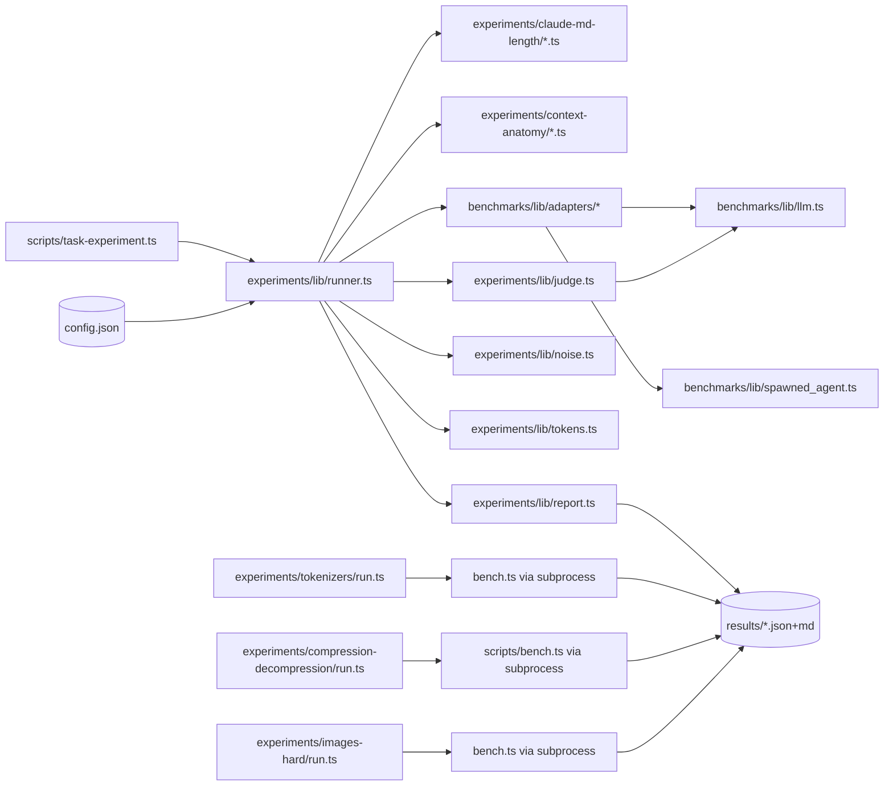

# SDS

## 1. Intro

- **Purpose:** Describe the architecture of the `flowai-experiments` harness — how the runner composes adapters, judge, noise, tokens, and report libs to drive a parameterized empirical sweep and commit reproducible evidence.
- **Rel to SRS:** Implements FR-EXP-RUN, FR-EXP-JUDGE, FR-EXP-NOISE, FR-EXP-TOKENS, FR-EXP-REPORT, FR-EXP.MEMORY-LENGTH, FR-EXP.CONTEXT-ANATOMY, FR-EXP-ADAPTERS, FR-EXP.TOKENIZERS, FR-EXP.COMPRESSION, FR-EXP.IMAGES-HARD.

## 2. Arch

- **Diagram:**

- **Subsystems:**
  - **CLI** — `scripts/task-experiment.ts`: flag parsing, variant resolution, runner invocation.
  - **Runner lib** — `scripts/experiments/lib/`: `runner`, `judge`, `noise`, `tokens`, `report`, `types`.
  - **Experiment variants** — `scripts/experiments/<name>/<variant>.ts`: implement the `Experiment` interface.
  - **Minimal agent runtime** — `scripts/benchmarks/lib/`: `adapters/*`, `llm`, `spawned_agent`, `usage`, `utils`. Name is a historical artifact from the `flow` split; Phase-3 rename planned.
  - **Standalone benchmarks** — `scripts/experiments/{tokenizers,compression-decompression,images-hard}/`: self-contained codebases with own runners; each has a thin `run.ts` shim that spawns the underlying `bench.ts` as a subprocess and normalises output into `results/`.

## 3. Components

### 3.1 CLI (`scripts/task-experiment.ts`)

- **Purpose:** Entry point. Parses flags (`--variant`, `--model`, `--ide`, `--reps`, `--axis <name>=<csv>` repeatable, `--seed`, `--dry-run`), loads the variant file dynamically, invokes the runner. Axis-override keys are validated against `experiment.axes` — unknown names fail fast. No experiment-specific flag (e.g. `--sizes`, `--rules`) is hard-coded at the CLI level; those belong inside each variant.
- **Interfaces:** `deno task experiment <name> [flags]`.
- **Deps:** `runner`, variant module, `config.json`.

### 3.2 Runner (`scripts/experiments/lib/runner.ts`)

- **Purpose:** Sweep engine. Builds the cartesian product of axes, prepares a sandbox per trial, invokes the adapter, calls the judge, aggregates adherence, writes the report.
- **Interfaces:** `runExperiment(experiment, opts): Promise<ExperimentReport>`.
- **Deps:** `types`, adapter registry, `judge`, `report`.
- **Behavior:**
  - Per cell: iterate `reps` trials. Trial fails fast on unrecoverable errors (missing auth, missing config). Trial verdict `exitCode != 0` → counted as fail, sweep continues.
  - Dry-run prints the plan (cells × reps × expected duration) and exits.
  - Adherence aggregated per primary axis → `ExperimentReport.adherenceByAxis`.

### 3.3 Judge (`scripts/experiments/lib/judge.ts`)

- **Purpose:** Single-rule binary verdict from an LLM judge.
- **Interfaces:** `judge({rule, userQuery, agentOutput}): Promise<{pass: bool, reason: string}>`.
- **Deps:** `benchmarks/lib/llm.ts` (which wraps the judge-model client).
- **Behavior:** Structured JSON output with strict schema. The judge sees rule + original query + full agent output. It does NOT see memory files or noise.

### 3.4 Noise (`scripts/experiments/lib/noise.ts`)

- **Purpose:** Deterministic noise sampling from a committed corpus.
- **Interfaces:** `sampleNoise(corpus, targetTokens, seed): string`.
- **Deps:** `tokens` for length measurement.
- **Behavior:** Same `(corpus, targetTokens, seed)` → byte-identical output. Implementation samples contiguous or shuffled spans per seed policy.

### 3.5 Tokens (`scripts/experiments/lib/tokens.ts`)

- **Purpose:** Lightweight token estimation (1 token ≈ 4 chars, ±15%).
- **Interfaces:** `countTokens(text): number`, `sliceToTokens(text, n): string`.
- **Deps:** none.
- **Behavior:** Intentionally approximate. Axis values are nominal budgets, not exact byte counts.

### 3.6 Report (`scripts/experiments/lib/report.ts`)

- **Purpose:** Emit committed per-run artifacts.
- **Interfaces:** `writeJson(report, path)`, `writeMarkdown(report, path)`.
- **Deps:** `types.ExperimentReport`.
- **Behavior:** JSON is the canonical raw artifact. Markdown is derived: headline + adherence-by-tokens table + per-rule breakdown + sample failures.

### 3.7 Adapters (`scripts/benchmarks/lib/adapters/`)

- **Purpose:** Encapsulate IDE-specific memory-file placement and agent spawning.
- **Interfaces:** `AgentAdapter` (see `adapters/types.ts`): `name`, `writeMemory(sandbox, files)`, `spawn(sandbox, query): Promise<{output, exitCode, durationMs, tokensUsed?}>`.
- **Deps:** `spawned_agent.ts`, `llm.ts`, `usage.ts`.
- **Registry:** `adapters/mod.ts` exposes `{claude, cursor}`.
- **Claude adapter:** spawns `claude -p <query> --strict-mcp-config --disable-slash-commands` with env `CLAUDE_CONFIG_DIR=<cleanroom temp dir>`, `CLAUDECODE=""`. The adapter's `getCleanroomEnv` copies one file into the cleanroom dir at run-start — `~/.claude/.credentials.json` — and nothing else, so the spawned CLI authenticates normally but sees no global `CLAUDE.md`, no plugins, no marketplace, no MCP config. The `--strict-mcp-config` + `--disable-slash-commands` flags further strip account-level MCP servers and slash commands from the system prompt. Built-in tools/skills/agents embedded in the `claude` binary remain in the baseline by design (see FR-EXP.CONTEXT-ANATOMY). Cross-platform — no macOS-keychain dependency. Memory layout supports hierarchical `CLAUDE.md`.
- **Cursor adapter:** writes `.cursorrules` at sandbox root. Does not support hierarchical memory — `tree-sum` variant is Claude-only.

### 3.8 Experiment Variants

- **Purpose:** Concrete experiment implementations.
- **Contract:** Each variant module default-exports an `Experiment` satisfying `types.ts:Experiment`. Optional `renderCustom?(report)` returns a markdown block appended to the rendered report before `## Caveats` — used when the payload is not pass/fail adherence.
- **`claude-md-length/`** — `single-file.ts`, `tree-sum.ts`, `shared.ts` (shared rules + query), `noise-corpus.md` (committed prose corpus).
  - Behavior (single-file): places all memory tokens in one root `AGENTS.md` (+ `CLAUDE.md` symlink). Sweeps `tokens × rule × reps`.
  - Behavior (tree-sum): splits the total budget evenly across `AGENTS.md`, `documents/AGENTS.md`, `scripts/AGENTS.md`. Sweeps the sum.
- **`context-anatomy/`** — `baseline.ts`, `shared.ts`, `README.md`. Implements FR-EXP.CONTEXT-ANATOMY.
  - Behavior (baseline): sweeps `tokens` axis only, uses a vacuous stub judge (non-empty response), extracts `cache_creation_input_tokens` / `cache_read_input_tokens` / init-event counts from `TrialResult.agentOutput` NDJSON via `shared.extractContextMetrics`, and renders the per-axis metric table in `renderCustom`. Measures the CLI-intrinsic baseline that `claude-md-length` numbers are relative to.

### 3.9 Standalone Benchmarks

- **Purpose:** Self-contained measurement tools that call external APIs directly (no agent spawning). Each lives under `scripts/experiments/<name>/` with its own `deno.json`, assets, and runner. A thin `run.ts` shim (~80 LOC) serves as the entry point.
- **Shim contract:** accepts `--dry-run` (print plan, exit 0), `--model <id>`, experiment-specific flags; spawns the underlying `bench.ts` as a subprocess with `cwd: EXPERIMENT_DIR` and `Deno.execPath()` to preserve the sub-project import map; copies output to `results/<YYYY-MM-DD>-<HHMM>-<name>-<model-slug>.{json,md}`.
- **`tokenizers/`** — measures tokens/char across 40+ UDHR language corpora. Uses `OPENROUTER_API_KEY`. Smoke test: `tokenizers_test.ts::smoke`.
- **`compression-decompression/`** — two-stage compress→decompress pipeline for 4 technical document scenarios. Uses Claude CLI via spawned subprocess. Has its own `deno.json` with `@bench/` import alias; root `check` ignores it; `check:compression` runs it with `BENCH_HEALTH_DISABLE=1` (health gate is for live runs, not CI). Smoke test: `lib/runner_test.ts::runs_two_stages_and_emits_artefacts`.
- **`images-hard/`** — text-to-image benchmark; 12 hard test cases (typography, anatomy, geometry, schematics). Uses `OPENROUTER_API_KEY`. Smoke test: `images_test.ts::smoke`.
- **Deps:** `@std/fs`, `@std/path` (root import map for tokenizers/images-hard; sub-project import map for compression-decompression).
- **Env:** `OPENROUTER_API_KEY` in `.env` at repo root (loaded via `--env-file=.env` in `experiment:tokenizers` and `experiment:images-hard` tasks).

## 4. Data

- **Entities:** `Cell`, `CellContext`, `JudgeRequest`, `TrialResult`, `Experiment`, `ExperimentReport` — all defined in `scripts/experiments/lib/types.ts`.
- **Schemas:**
  - `ExperimentReport` is `schemaVersion: 1`. Breaking changes bump the version.
  - `TrialResult.tokensUsed` is optional — some adapter paths do not expose usage.
  - `ExperimentReport.customMarkdown` is optional — populated by `Experiment.renderCustom?` when present; rendered verbatim before the Caveats block.
  - `adherenceByAxis` is `Record<primaryAxis, Record<axisValue, rate>>`.
- **Storage:** Results live at `./results/<YYYY-MM-DD>-<HHMM>-<model-slug>-<variant>.{json,md}` at the repo root (shared across all experiments; filename disambiguates by model + variant + time). Committed to git. Never rewritten. `.md` is tracked, `.json` is gitignored (full per-trial raw data is kept locally only).

## 5. Logic

- **Algos:**
  - **Sweep order:** axes are iterated in declaration order; `reps` is the innermost loop. Deterministic.
  - **Seed derivation:** `trialSeed = hash(baseSeed, JSON.stringify(cell.axes), cell.trial)`. Passed into `setupCell` so noise/layout is reproducible.
  - **Adherence:** `mean(pass ? 1 : 0 over trials in cell)`. Aggregation per primary axis: `mean(cell_adherence over secondary-axis values at fixed primary-axis value)`.
  - **Headline (claude-md-length):** `max(tokens : mean_adherence(tokens) ≥ 0.8)`. If non-monotonic, report the largest token budget such that all smaller budgets also pass the threshold.
- **Rules:**
  - One rule per trial — never all active at once (they would compete).
  - Rule is embedded at the 50% line position within the root memory file (isolates budget effect from position effect — position is a future experiment).
  - Query is neutral — must not hint at the rule under test.
  - Environment must be fully isolated — otherwise global `~/.claude/CLAUDE.md` pollutes the `language` rule signal.

## 6. Non-Functional

- **Scale/Fault/Sec/Logs:**
  - **Scale:** sweeps grow multiplicatively in axis cardinality × reps. Keep reps small (5 is the current floor for first-pass signal).
  - **Fault tolerance:** trials fail independently. Unrecoverable errors (missing `claude` binary, missing OAuth, missing config) abort the whole run with a clear message.
  - **Sec:** credentials come from the host-level `~/.claude/.credentials.json` (produced by `claude login` on the developer's machine). The claude adapter copies that single file into a per-run cleanroom config dir and never reads its contents into results. Cleanroom dir is removed after the run. Sandbox temp dirs are cleaned up per-trial.
  - **Logs:** per-trial stdout is captured into `TrialResult.agentOutput`. Judge reasons are captured into `TrialResult.judgeReason`. Both are committed as part of the JSON report.

## 7. Constraints

- **Simplified/Deferred:**
  - **Token counting** is a 4-char heuristic — swap in a real tokenizer later if precision matters.
  - **Rule position** is fixed at 50%. Position sweep is a separate experiment.
  - **Reps** = 5 → ~30% confidence interval on single-cell adherence. Accept for first-pass signal; increase for publication.
  - **IDE coverage:** `cursor` adapter supports single-file variant only. `tree-sum` is Claude-only.
  - **`scripts/benchmarks/lib/` naming** is a historical artifact from the `flow` split. Phase-3 rename to `scripts/lib/runtime/` planned (no import rewrites needed if path stays stable until then).
  - **No CI experiment runs.** Experiments require a live, externally-authorized Claude CLI (`claude login` → `~/.claude/.credentials.json`) — run manually on dev machines (macOS or Linux devcontainer).
  - **CLI-intrinsic baseline is NOT subtracted.** Every trial carries ~26k tokens of built-in system prompt + tool/skill/agent descriptors (embedded in the `claude` binary) plus dynamic sections injected by the CLI at startup. FR-EXP.CONTEXT-ANATOMY quantifies this floor; FR-EXP.MEMORY-LENGTH headline numbers are explicitly relative to it. Rationale: the experiments measure what a user experiences in the real operating environment, not in an idealized vacuum.
